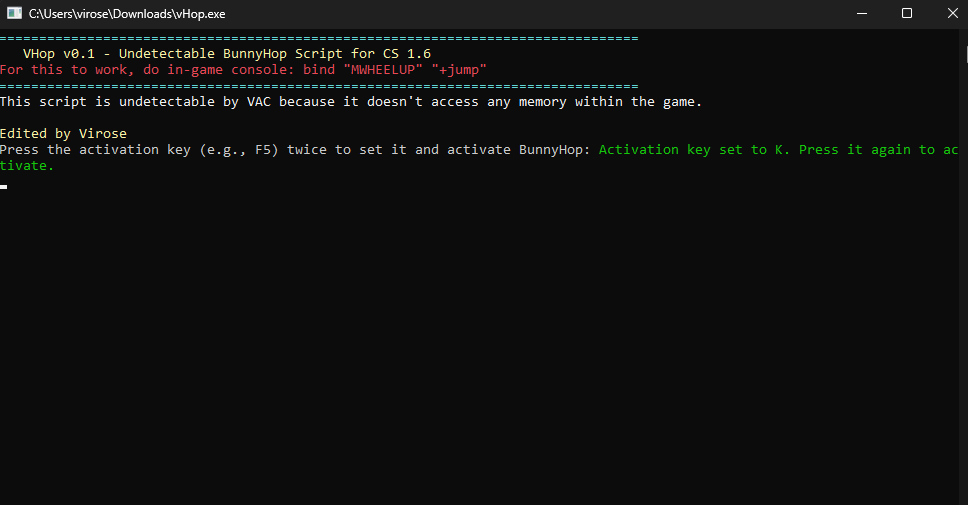

VHop is a bunny-hop script designed for Counter-Strike 1.6, allowing players to execute perfect bunny hops in the game. Please use this script responsibly and respect the rules and guidelines of the game and server you're playing on.

## Features

- Bunny Hopping
- Undetectable
- Lightweight

## Usage

1. Download the script files from the [Releases](https://github.com/mountainofwhiteness/vhop/releases) section.
2. Extract the files to a directory of your choice.
3. Launch Counter-Strike 1.6.
4. Launch VHop.exe.
5. Enjoy Vhoppin.

**Note**: Ensure you are using VHop responsibly and following the rules of the game and server. Misuse of this script may result in consequences from server administrators or anti-cheat systems.

## Disclaimer

This script is intended for educational and entertainment purposes only. The creator of VHop (virose) is not responsible for any consequences or misuse of this script. Use it at your own discretion, and ensure you are complying with the rules and regulations of the game and the servers you play on.

## Contributing

## Screenshots

If you would like to contribute to VHop, feel free to submit pull requests or open issues. Your contributions are welcome.

## License

This project is licensed under the MIT License. See the [LICENSE](LICENSE) file for details.

---

**Disclaimer: This script is provided for educational and entertainment purposes only. The creator is not responsible for any consequences or misuse of this script. Use it responsibly and at your own risk.**

For any questions or issues, please open an [issue](https://github.com/mountainofwhiteness/vhop/issues).
